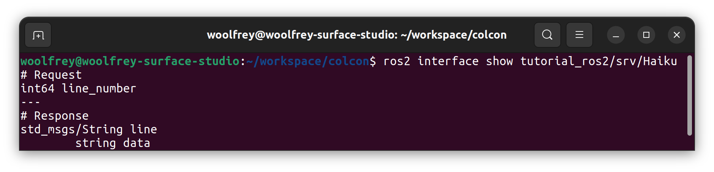
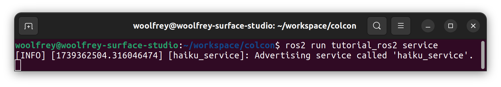
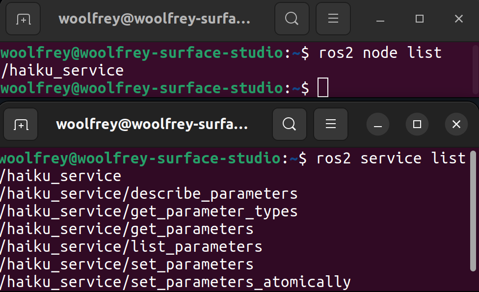
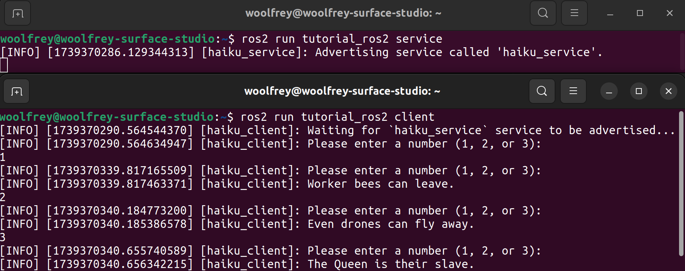

# Service & Client

[🔙 Back to `main`](https://github.com/Woolfrey/tutorial_ros2/blob/main/README.md#ros2-c-tutorials)

This coding tutorial demonstrates how to implement a simple ROS2 service in C++, and a client.

### Contents:
- 1 Defining a Service
  - 1.1 Create the Service File
  - 1.2 Edit the Configuration Files
  - 1.3 Compile and Inspect the Service
- 2 Creating a Service
  - 2.1 Create the Header File
  - 2.2 Create the Source File
  - 2.3 Create the Executable
  - 2.4 Edit the Configuration Files
  - 2.5 Compiling & Running the Package
- 3 Creating a Client
  - 3.1 Create the Header File
  - 3.2 Create the Source File
  - 3.3 Create the Executable
  - 3.4 Edit the Configuration Files
  - 3.5 Compiling & Running the Package
 
The folder structure for our package will look like this:
```
ros2_workspace/
├─ build/
├─ install/
├─ log/
└──src/
    └── tutorial_ros2/
        ├─ include/
        |   ├─  HaikuClient.h
        |   └── HaikuService.h
        ├─ src/
        |   ├─  HaikuClient.cpp
        |   ├─  HaikuService.cpp
        |   ├─  client.cpp
        |   └── service.cpp
        ├─ srv/
        |   └── Haiku.srv
        ├── CMakeLists.txt
        └── package.xml
```

## 1 Defining a Service

A service is declared using a `.srv` file in ROS2. This tells both the server & client what data is being sent and returned during communication. It is composed of two parts:
1. A request, which defines what data the client will send, and
2. A response, which defines what the server will return:

```
# Request
package/Type request
---
# Response
package/Type response
```
Both the request and response fields can be composed of any number of fields and data types.

### 1.1 Create the Service File :card_index:

In `srv/Haiku.srv` we will request the line number, and in return the server will return a `std_msgs::msg::String` object:
```
int64 line_number
---
std_msgs/String line
```
[:arrow_up: Back to top.](#service--client)

### 1.2 Edit the Configuration Files :hammer_and_wrench:

ROS2 will convert the `.srv` service definition in to useable code. We must give it instructions to do so in the `CMakeLists.txt` file:
```
find_package(rclcpp REQUIRED)
find_package(rosidl_default_generators REQUIRED)
find_package(std_msgs)

```
We need:
- `rclcpp` for the ROS2 C++ client libraries,
- `rosidl_default_generators` to tell it how to build the `.srv` file in to useable code, and
- `std_msgs` which contains the `String` field
  
Then beneath it we add:
```
rosidl_generate_interfaces(${PROJECT_NAME} "srv/Haiku.srv"
                           DEPENDENCIES std_msgs)
```
which then tells ROS2 to compile the file we just created under the current project name.

Simultaneously we must modify the `package.xml` file to match:
```
<depend>rclcpp</depend>
<depend>std_msgs</depend>
<build_depend>rosidl_default_generators</build_depend>
<exec_depend>rosidl_default_runtime</exec_depend>
<member_of_group>rosidl_interface_packages</member_of_group>
```

[:arrow_up: Back to top.](#service--client)

### 1.3 Compile & Inspect the Service :computer:

Navigate to the ROS2 working directory:
```
cd ~/ros2_workspace
```
then build the package:
```
colcon build --packages-select tutorial_ros2
```
Make sure you source the changes if you haven't added this to your `.bashrc` file:
```
source ./install.setup.bash
```
Now we can check the details of the newly defined service:
```
ros2 interface show tutorial_ros2/srv/Haiku
```
<p align="center">
  
  <br>
  <em> Figure 1: We can show the request and response fields of services in ROS2.</em>
</p>

[:arrow_up: Back to top.](#service--client)

## 2 Creating a Service

### 2.1 Create the Header File :page_facing_up:

Next we will create a header file for a `HaikuService` class. ROS2 is designed around oject-oriented programming (OOP). This may seem superfluous, but the advantage is we can easily generate multiple objects, such as services, with unique parameters.

Separating definitions from source code is also good practice in C++. This can improve compile time for large projects.

Create a file in `include/HaikuService.h' and insert the following code:
```
#ifndef HAIKU_SERVICE_H
#define HAIKU_SERVICE_H

#include <rclcpp/rclcpp.hpp>
#include <std_msgs/msg/string.hpp>
#include <tutorial_ros2/srv/haiku.hpp>

class HaikuService : public rclcpp::Node
{
    using Haiku = tutorial_ros2::srv::Haiku;
    
    public:

        HaikuService(const std::string &nodeName    = "haiku_service",
                     const std::string &serviceName = "haiku_service");
                     
    private:
    
        rclcpp::Service<Haiku>::SharedPtr _service;
        
        void get_line(const std::shared_ptr<Haiku::Request>  request,
                            std::shared_ptr<Haiku::Response> response);
};
#endif
```

#### Inspecting the Code :mag:

The important lines of code to consider here are:
- `#include "tutorial_ros2/srv/haiku.hpp"`: We need to reference the header files built by ROS2 so we can actually use the service.
- `class HaikuService : public rclcpp::Node`: Our HaikuService class inherits a ROS Node class, to make use of its methods.
- `using Haiku = tutorial_ros2::srv::Haiku;`: This is just to make the code easier to read.
- `rclcpp::Service<Haiku>::SharedPtr _service;`: This object is responsible for advertising the service, and processing requests.
- `void get_line(...)`: This method is what will process the request.

[:arrow_up: Back to top.](#service--client)

### 2.2 Create the Source File :page_facing_up:

Now we will elaborate on the constructor and method specified in the header file. Create a file `src/HaikuService.cpp` and insert the following code:
```
#include <HaikuService.h>

HaikuService::HaikuService(const std::string &nodeName,
                           const std::string &serviceName)
                           : Node(nodeName)
{
    using namespace std::placeholders;
    
    _service = this->create_service<Haiku>(serviceName, std::bind(&HaikuService::get_line, this, _1, _2));

    RCLCPP_INFO(this->get_logger(), "Advertising service called '%s'.", serviceName.c_str());
}

void
HaikuService::get_line(const std::shared_ptr<Haiku::Request>  request,
                             std::shared_ptr<Haiku::Response> response)
{
     switch(request->line_number)
     {    
          case 1:
          {
               response->line.data = "Worker bees can leave.";
               break;
          }
          case 2:
          {
               response->line.data = "Even drones can fly away.";
               break;
          }
          case 3:
          {
               response->line.data = "The Queen is their slave.";
               break;
          }
          default:
          {
               response->line.data = "FLAGRANT REQUEST ERROR: Expected request of 1, 2, or 3 but yours was "
                                   + std::to_string(request->line_number);
               break;
          }
     }
}
```

#### Inspecting the Code :mag:

##### **_The Constructor:_**

This line of code at the beginning is simply to make the proceeding code shorter.
```
using namespace std::placeholders;
```
In this line we create & advertise the service:
```
_service = this->create_service<Haiku>(serviceName, std::bind(&HaikuService::get_line, this, _1, _2));
```
The important components are:
1. `this->` referring to this node that is created alongside the class.
2. `serviceName` which will be seen on the ROS2 network, then:
3. `std::bind` which attaches the `get_line` method to `this` class, with 2 arguments that are enumerated in sequence: `_1, _2`.

##### **_The Service Request Method:_**

Next we have the single private method:
```
void HaikuService::get_line(const std::shared_ptr<Haiku::Request>  request,
                                  std::shared_ptr<Haiku::Response> response)
{
  ...
}
```
which takes both the `Request` and `Response` portions of the `Haiku.srv` as arguments.

Notice that the `request` argument is preceeded by a `const`; we are forbidden from modifying the request data.

Inside the code, we simply check the line number `request->line_number`, and add the appropriate response to the data field of the string `response->line.data`.

Since they are using a `std::shared_ptr` by default, the data is inserted directly at the memory location. There is no need to return any data from the method itself.

[:arrow_up: Back to top.](#service--client)

### 2.3 Create the Executable :gear:

Now we want to create an actual executable to make use of the `HaikuService` class. Create `src/service.cpp` and insert the code:
```
#include "HaikuService.h"
#include "rclcpp/rclcpp.hpp"

int main(int argc, char *argv[])
{
    rclcpp::init(argc, argv);
    
    auto haikuService = std::make_shared<HaikuService>("haiku_service", "haiku_service");

    rclcpp::executors::SingleThreadedExecutor executor;
    executor.add_node(haikuService);
    executor.spin();
    
    rclcpp::shutdown();
    
    return 0;
}
```

#### Inspecting the Code :mag:

The line `rclcpp::init(argc, argv)` starts up ROS2.

Then we create an instance of the `HaikuService` class with:
```
auto haikuService = std::make_shared<HaikuService>("haiku_service", "haiku_service");
```
where we give it both the same name for the node itself, and the name of the service: `haiku_service`.

Next, in these 3 lines of code:
```
rclcpp::executors::SingleThreadedExecutor executor;
executor.add_node(haikuService);
executor.spin();
```
we:
1. Create an executor to actually run the node,
2. Attach our `haikuService` node that we just created, then
3. Run it.

Note that we also could have defined the `HaikuService` class, its source code, _and_ the `main()` method all within the `service.cpp` file itself. By making it a class, we can create multiple service nodes each with unique parameters. We can then attach them all to the executor and run them:
```
auto haikuService1 = std::make_shared<HaikuService>("haiku_service_1", "haiku_1");
auto haikuService2 = std::make_shared<HaikuService>("haiku_service_2", "haiku_2");
auto haikuService3 = std::make_shared<HaikuService>("haiku_service_2", "haiku_3");

rclcpp::executors::MultiThreadedExecutor executor;
executor.add_node(haikuService1);
executor.add_node(haikuService1);
executor.add_node(haikuService1);
```
We could program the class to return _different_ responses using the _same_ interface.

[:arrow_up: Back to top.](#service--client)

### 2.4 Edit the Configuration Files :hammer_and_wrench:

Now we need to modify the `CMakeLists.txt` file to build the new executable `service.cpp`. Insert these lines of code near the top of the file:
```
include_directories(include
                    ${CMAKE_CURRENT_BINARY_DIR}/rosidl_generator_cpp)
```
This tells the compiler to look for the header files in `include/`, as well as the location for the custom header file generated when building the `Haiku.srv` file.

We also want to append:
```
find_package(${PROJECT_NAME} REQUIRED)
```
since the `HaikuService` class is dependent on the `srv` built within this package.

Now at the bottom of the file we tell the compiler to build the executable:
```
add_executable(service src/service.cpp src/HaikuService.cpp)
```
Its name will be `service` and we must list all the source files it is dependent on.

Next we list dependencies for the `service` executable:
```
ament_target_dependencies(service
    rclcpp
    std_msgs
    ${PROJECT_NAME}
)
```
It needs:
- `rclcpp` for the ROS2 C++ client libraries,
- `std_msgs` for the `std_msgs::msg::String` type, and
- `${PROJECT_NAME}$` referring to `tutorial_ros` in which the custom `srv` is compiled.

Finally, we tell it to install the executable so ROS2 can find and run it:
```
install(TARGETS
    service
    DESTINATION lib/${PROJECT_NAME})
```

[:arrow_up: Back to top.](#service--client)

### 2.5 Compiling & Running the Package :computer:

Navigate back to the root of `ros2_workspace` and compile:
```
colcon build --packages-select tutorial_ros2
```
We should now be able to run the service node:
```
ros2 run tutorial_ros2 service
```

<p align="center">
  
  <br>
  <em>Figure 2: The service node is up and running.</em>
</p>

In another terminal, we can use `ros2 node list` to see that our node is visible on the ROS2 network. We can also see that it is advertising the service with `ros2 service list`.

<p align="center">
  
  <br>
  <em> Figure 3: Listing the service node and its advertised services.</em>
</p
  
Notice that they have the names that were assigned in the `service.cpp` file: "haiku_service".

## 3 Creating a Service

### 3.1 Create the Header File :page_facing_up:

As before, we will separate definitions for the class from its implementation.

Create the file `include/HaikuClient.h` and insert the following code:
```
#ifndef HAIKU_CLIENT_H
#define HAIKU_CLIENT_H

#include <rclcpp/rclcpp.hpp>
#include <std_msgs/msg/string.hpp>
#include "tutorial_ros2/srv/haiku.hpp"

class HaikuClient : public rclcpp::Node
{
    using Haiku = tutorial_ros2::srv::Haiku;
    
    public:

        HaikuClient(const std::string &nodeName    = "haiku_client",
                    const std::string &serviceName = "haiku_service");
    
    private:

        rclcpp::Client<Haiku>::SharedPtr _client;

        void get_user_input();

        void send_request(const int &lineNumber);

        void process_response(rclcpp::Client<tutorial_ros2::srv::Haiku>::SharedFuture future);
    
};
#endif
```

#### Inspecting the Code :mag:

Here are the important lines of code to consider:
- `class HaikuClient : public rclcpp::Node` This class will build on & inherit all the features of a ROS2 node,
- `using Haiku = tutorial_ros2::srv::Haiku` Used to make proceeding code shorter
- `rclcpp::Client<Haiku>::SharedPtr _client` This object is responsible for communicating with the server node.

There are 3 methods unique to this class that will run in sequence:
1. `get_user_input()` to retrieve a command from the terminal, which will then call:
2. `send_request()` which does as you'd expect, then
3. `process_response()` which will retrieve the answer from the server.

[:arrow_up: Back to top.](#service--client)

### 3.2 Create the Source File :page_facing_up:

```
/**
 * @file   HaikuClient.cpp
 * @author Jon Woolfrey
 * @data   February 2025
 * @brief  Source code for the HaikuClient class.
 */

#include <HaikuClient.h>
#include <thread>

HaikuClient::HaikuClient(const std::string &nodeName,
                         const std::string &serviceName)
                         : Node(nodeName)
{
    _client = this->create_client<tutorial_ros2::srv::Haiku>(serviceName);

    RCLCPP_INFO(this->get_logger(), "Waiting for `%s` service to be advertised...", serviceName.c_str());

    auto startTime = std::chrono::steady_clock::now();

    while (not _client->wait_for_service(std::chrono::milliseconds(500)))
    {
        if (not rclcpp::ok())
        {
            RCLCPP_ERROR(this->get_logger(), "Client interrupted while waiting for service. Exiting...");
            
            return;
        }

        if (std::chrono::steady_clock::now() - startTime > std::chrono::seconds(5))
        {
            RCLCPP_ERROR(this->get_logger(), "Service `%s` not available after 5 seconds. Shutting down...", serviceName.c_str());
            
            rclcpp::shutdown();
            
            return;
        }
    }  
    
    std::thread(&HaikuClient::get_user_input, this).detach();
}

void HaikuClient::get_user_input()
{
    int userInput;

    while (rclcpp::ok())
    {
        RCLCPP_INFO(this->get_logger(), "Please enter a number (1, 2, or 3):");
        
        std::cin >> userInput;

        if (std::cin.fail()) 
        {
            std::cin.clear();
            std::cin.ignore(std::numeric_limits<std::streamsize>::max(), '\n');
            RCLCPP_WARN(this->get_logger(), "Invalid input.");
            continue;
        }

        if (userInput == 1 or userInput == 2 or userInput == 3)
        {
            send_request(userInput);
        }
        else
        {
            RCLCPP_WARN(this->get_logger(), "Number must be between 1 and 3.");
        }
    }
}

void HaikuClient::send_request(const int &lineNumber)
{
    auto request = std::make_shared<tutorial_ros2::srv::Haiku::Request>();
    
    request->line_number = lineNumber;

    auto future = _client->async_send_request(request,
                                              std::bind(&HaikuClient::process_response, this, std::placeholders::_1));
}

void HaikuClient::process_response(rclcpp::Client<tutorial_ros2::srv::Haiku>::SharedFuture future)
{
    auto response = future.get();

    if (response)
    {
        RCLCPP_INFO(this->get_logger(), "%s", response->line.data.c_str());
    }
    else
    {
        RCLCPP_ERROR(this->get_logger(), "Service request failed.");
    }
}
```

#### Inspecting the Code :mag:

##### **_The Constructor:**
Inside the constructor we create the client object:
```
    _client = this->create_client<tutorial_ros2::srv::Haiku>(serviceName);
```
Its components are:
1. `this->` referring to the `rclcpp::Node` that was inherited,
2. A template parameter of the service type `tutorial_ros2::srv::Haiku`, and
3. An argument for the `serviceName` which _must_ match that advertised by the server.

This loop waits 5 seconds for the service to appear:
```
    while (not _client->wait_for_service(std::chrono::milliseconds(500)))
    {
      ...
    }
```
This is used to prevent code from proceeding and performing any unsafe actions.

Finally, a separate thread is created:
```
std::thread(&HaikuClient::get_user_input, this).detach();
```
It links to the `get_user_input()` method and independently executes after `detach()`.

##### **_Get User Input:_**

This method uses `std::cin >> userInput;` to retrieve a character from the terminal that any user types in.

If the input is sound, then it passes it on to the `send_request(userInput)` method.

##### **_Send Request:_**

In this method, we create a temporary object from the request field of `Haiku.srv`:
```
auto request = std::make_shared<tutorial_ros2::srv::Haiku::Request>()
```
Then we input the line number so it can be sent to the server:
```
    request->line_number = lineNumber;                                                              // Add to field
```
There are a few things occuring in this line:
```
auto future = _client->async_send_request(request, std::bind(&HaikuClient::process_response, this, std::placeholders::_1)); // Bind method below
```
First, we send the request to the server. The `async` indicates that the code will continue running while we wait.

The reponse will be put in the `future` return value, and execute the `process_response` method which we have bound to the request.

In other words, it will call `process_request` and input the `future` in to it as an argument.

##### **_Processing the Request:_**

This is very simple. We retrieve the `response` portion of `Haiku.srv` with `future.get()`, then print the results.

[:arrow_up: Back to top.](#service--client)

### 3.3 Create the Executable :gear:

Again we create a very simple executable in `src/client.cpp`:
```
#include <HaikuClient.h>
 
int main(int argc, char *argv[])
{
    rclcpp::init(argc, argv);
    
    auto haikuClient = std::make_shared<HaikuClient>("haiku_client", "haiku_service");

    rclcpp::executors::SingleThreadedExecutor executor;
    executor.add_node(haikuClient);
    executor.spin();
    
    rclcpp::shutdown();
    
    return 0;
}
```

#### Inspecting the Code :mag:
The basic steps are:
1. Run ROS2 via `rclcpp::init(argc, argv)`,
2. Create an instance of our class with `auto haikuClient = std::make_shared<HaikuClient>("haiku_client", "haiku_service")`,
3. Create an executor and attach the node/class `executor.add_node(haikuClient)`, then
4. Run it indefinitely: `executor.spin()`.

>[!NOTE]
> The `nodeName` for the `HaikuClient` constructor is "haiku_client", but the `serviceName` argument is "haiku_service". This _must_ match what is advertised by the service node.

[:arrow_up: Back to top.](#service--client)

### 3.4 Edit the Configuration Files :hammer_and_wrench:

We need to tell the compiler to create our new executable in `CMakeLists.txt`:
```
add_executable(client src/client.cpp src/HaikuClient.cpp)
```
We give it the name `client` and list its source files.

Next we need to list its dependencies:
```
ament_target_dependencies(client
                          "rclcpp"
                          "std_msgs"
                          ${PROJECT_NAME})
```
As before,
1. ROS2 C++ client libraries,
2. std_msgs package, and
3. This project with the custom service header files.

Lastly, we append it to the install list so ROS2 can find it:
```
install(TARGETS service
                client
        DESTINATION lib/${PROJECT_NAME})
```

[:arrow_up: Back to top.](#service--client)

### 3.5 Compiling & Running the Package :computer:

Navigate back to the root of the ROS2 workspace directory and build:
```
colcon build --packages-select tutorial_ros2
```
First, run the service in one terminal:
```
ros2 run tutorial_ros2 service
```
Then in a separate terminal you can run the client:
```
ros2 run tutorial_ros2 client
```
You can freely enter an input to the terminal to see how it works.

<p align="center">
  
  <br>
  <em> Figure 3: The client sending a request & receiving a response from the server.</em>
</p>

[:arrow_up: Back to top.](#service--client)

[🔙 Back to `main`](https://github.com/Woolfrey/tutorial_ros2/blob/main/README.md#ros2-c-tutorials)
