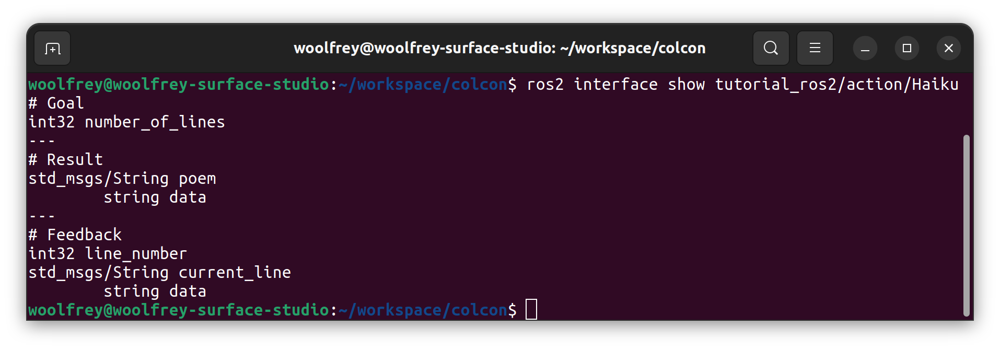
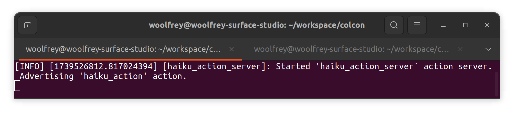
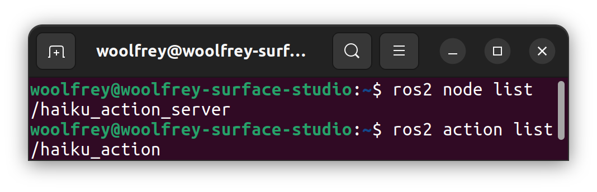

# Action Servers & Action Clients

[🔙 Back to `main`](https://github.com/Woolfrey/tutorial_ros2/blob/main/README.md#ros2-c-tutorials)

This coding tutorial demonstrates how to implement a simple ROS2 action server & client.

### Contents:
- [1 Defining an Action](#1-defining-an-action)
  - [1.1 Create the Action File](#11-create-the-action-file-card_index)
  - [1.2 Edit the Configuration Files](#12-edit-the-configuration-files-hammer_and_wrench)
  - [1.3 Compile and Inspect the Action](#13-compile--inspect-the-action-computer)
- [2 Creating an Action Server](#2-creating-an-action-server)
  - [2.1 Create the Header File](#21-create-the-header-file-page_facing_up)
  - [2.2 Create the Source File](#22-create-the-source-file-page_facing_up)
  - [2.3 Create the Executable](#23-create-the-executable-gear)
  - [2.4 Edit the Configuration Files](#24-edit-the-configuration-files-hammer_and_wrench)
  - [2.5 Compiling & Running the Package](#25-compiling--running-the-package-computer)
- [3 Creating an Action Client](#3-creating-an-action-client)
  - [3.1 Create the Header File](31-create-the-header-file-page_facing_up)
  - [3.2 Create the Source File](#32-create-the-source-file-page_facing_up)
  - [3.3 Create the Executable](#33-create-the-executable-gear)
  - [3.4 Edit the Configuration Files](#34-edit-the-configuration-files-hammer_and_wrench)
  - [3.5 Compiling & Running the Package](#35-compiling--running-the-package-computer)
 
The folder structure for our package will look like this:
```
ros2_workspace/
├─ build/
├─ install/
├─ log/
└──src/
    └── tutorial_ros2/
        ├─  action/
        |   └── Haiku.action
        ├─ include/
        |   ├─  HaikuActionClient.h
        |   └── HaikuActionServer.h
        ├─ src/
        |   ├─  HaikuActionClient.cpp
        |   ├─  HaikuActionServer.cpp
        |   ├─  action_client.cpp
        |   └── action_server.cpp
        ├── CMakeLists.txt
        └── package.xml
```

## 1 Defining an Action

Communication between an action server and client is defined by a `.action` file:
```
package/Type goal
---
package/Type result
---
package/Type feedback
```
It contains three parts:
1. A goal component providing data about what the server should achieve,
2. A result component providing data on the outcome of the action, and
3. Feedback that provides regular updates as the action is executing.

The goal & response function similarly to the client & service protocol, whereas the feedback will quite literally be published like the publisher protocol.

Whilst a service should provide a near-instantaneous response, an action should be used when a request will take several seconds or more to complete.

### 1.1 Create the Action File :card_index:

Create the file `action/Haiku.action` and insert the following code:
```
int32 number_of_lines
---
std_msgs/String poem
---
int32 line_number
std_msgs/String current_line
```
- The goal for the action is to read a given `number_of_lines` of an haiku.
- The result will be a `std_msgs/String` of the entire number of lines, and
- The feedback will be the current `line_number` and the `current_line`.


[:arrow_up: Back to top.](#action-servers--action-clients)

### 1.2 Edit the Configuration Files :hammer_and_wrench:

We need to edit the configuration files so the compiler knows to turn the `.action` definition in to useable code.

First add the following to  `CMakeLists.txt`:
```
find_package(std_msgs REQUIRED)
find_package(rosidl_default_generators REQUIRED)
```
- We need `std_msgs` for the `std_msgs/String` in `Haiku.action`,
- We need the `rosidl_default_generators` for converting the `.action` in to code.

Now we need to update the `package.xml` file to match. First add these:
```
<depend>std_msgs</depend>
<depend>action_msgs</depend>
```
Here we need the additional `action_msgs` not found in the `CMakeLists.txt` file. Then add:
```
<build_depend>rosidl_default_generators</build_depend>
<member_of_group>rosidl_interface_packages</member_of_group>
```

[:arrow_up: Back to top.](#action-servers--action-clients)

### 1.3 Compile & Inspect the Action :computer:

Navigate back to the root of your ROS2 workspace `cd ~/ros2_workspace` then build the package:
```
colcon build --packages-select tutorial_ros2
```
Make sure to source the changes if you haven't already told `.bashrc` to do so:
```
source ./install/setup.bash
```
Now we can check that it has compiled correctly with:
```
ros2 interface show tutorial_ros2/action/Haiku
```
which should print the following:
<p align="center">
  
  <br>
  <em> Figure 1: ROS2 showing the action definition for the Haiku with the goal, result, and feedback fields.</em>
</p>

[:arrow_up: Back to top.](#action-servers--action-clients)

## 2 Creating an Action Server

### 2.1 Create the Header File :page_facing_up:

It is good practice in C++ to separate the declarations (such as classes, functions, etc.) from the source code. This can improve compile times in large projects.

Create the file `include/HaikuActionServer.h` and insert the following code:
```
#ifndef HAIKU_ACTION_SERVER_H
#define HAIKU_ACTION_SERVER_H

#include "rclcpp/rclcpp.hpp"
#include "rclcpp_action/rclcpp_action.hpp"
#include "std_msgs/msg/string.hpp"
#include "tutorial_ros2/action/haiku.hpp"

class HaikuActionServer : public rclcpp::Node
{
    using Haiku = tutorial_ros2::action::Haiku;
    using HaikuGoalHandle = rclcpp_action::ServerGoalHandle<Haiku>;
    
    public:

        HaikuActionServer(const std::string &nodeName    = "haiku_action_server",
                          const std::string &serviceName = "haiku_action");
                          
    private:
    
        rclcpp_action::Server<Haiku>::SharedPtr _actionServer;

        rclcpp_action::GoalResponse
        handle_goal(const rclcpp_action::GoalUUID      &uuid,
                    std::shared_ptr<const Haiku::Goal> goal);

        void
        handle_accepted(const std::shared_ptr<HaikuGoalHandle> goalHandle);
        
        void
        execute(const std::shared_ptr<HaikuGoalHandle> goalHandle);

        rclcpp_action::CancelResponse
        handle_cancel(const std::shared_ptr<HaikuGoalHandle> goalHandle)
        {
             (void)goalHandle;
             
             RCLCPP_INFO(rclcpp::get_logger("haiku_action_server"),"Received cancellation request.");
            
             return rclcpp_action::CancelResponse::ACCEPT;
        }
        
};
#endif
```
Some of the more important lines of code to consider are:
- `#include "rclcpp_action/rclcpp_action.h"`: This contains the C++ libraries for ROS2 actions,
- `#include "tutorial_ros2/action/haiku.hpp"`: This enables us to use `Haiku.action` that we built in the same package,
- `class HaikuActionServer : public rclcpp::Node`: This class builds upon a ROS2 node along with all its functionality.
- `rclcpp_action::Server<Haiku>::SharedPtr _actionServer;`: This object is responsible for communicating with a client over ROS2.

There are also 4 methods:
1. `handle_goal(...)`: This will receive and process a request from an action client,
2. `handle_accepted(...)`: This is an intermediary method that can be used to prepare the class to execute an action.
3. `execute(...)`: Is where the action is carried out, and
4. `handle_cancel(...)`: Will process any cancellation request.

[:arrow_up: Back to top.](#action-servers--action-clients)

### 2.2 Create the Source File :page_facing_up:

#### Insert Headers :headstone:

Now create the `src/HaikuActionServer.cpp` file and insert this line at the top:
```
#include <HaikuActionServer.h>
```
which essentially inserts the header file and class declaration.

#### Insert the Constructor :building_construction:

```
HaikuActionServer::HaikuActionServer(const std::string &nodeName,
                                     const std::string &actionName)
                                     : Node(nodeName)
{
    using namespace std::placeholders;
    
    _actionServer = rclcpp_action::create_server<tutorial_ros2::action::Haiku>
    (
        this,
        actionName,
        std::bind(&HaikuActionServer::handle_goal,     this, _1, _2),
        std::bind(&HaikuActionServer::handle_cancel,   this, _1),
        std::bind(&HaikuActionServer::handle_accepted, this, _1)
    );
    
    RCLCPP_INFO(this->get_logger(),
                "Started '%s` action server. Advertising '%s' action.",
                nodeName.c_str(), actionName.c_str());
}
```
The lines proceeeding `_actionServer = ...` has many important components:
1. It uses a template argument `<tutorial_ros2::action::Haiku>` which tells it what the goal, result, and feedback data is,
2. `this` refers to the `rclcpp::Node` inherited by the `HaikuActionServer` class,
3. `actionName` is what will be advertised over the ROS2 network,
4. Then we use `std::bind` to attach the 3 methods needed to process & run an action.

#### Insert Goal Handling :goal_net:

```
rclcpp_action::GoalResponse
HaikuActionServer::handle_goal(const rclcpp_action::GoalUUID      &uuid,
                               std::shared_ptr<const Haiku::Goal> goal)
{
    (void)uuid;
    
    RCLCPP_INFO(this->get_logger(), "Received action request.");
    
    if(goal->number_of_lines < 1)
    {
        RCLCPP_WARN(this->get_logger(), "Requested number of lines was less than 1.");
        
        return rclcpp_action::GoalResponse::REJECT;
    }
    else
    {
        return rclcpp_action::GoalResponse::ACCEPT_AND_EXECUTE;
    }
}
```
This doesn't require much explanation. It checks that the number of lines is a positive integer, and accepts or rejects.

We use `(void)uuid` to stop colcon from issuing a warning when we build. But we could use this for other purposes.

For example, we could add a class member to keep track of active goals:
```
std::unordered_map<rclcpp_action::GoalUUID, std::shared_ptr<GoalHandleHaiku>> _activeGoals;
```
then check inside this method if it is already running:
```
if (_activeGoals.find(uuid) != _activeGoals.end())
{
    RCLCPP_WARN(get_logger(), "Duplicate goal received. Rejecting.");
    return rclcpp_action::GoalResponse::REJECT;
}
```

#### Insert Goal Acceptance :open_hands:

```
void
HaikuActionServer::handle_accepted(const std::shared_ptr<HaikuGoalHandle> goalHandle)
{
    std::thread{std::bind(&HaikuActionServer::execute, this, std::placeholders::_1), goalHandle}.detach();
}
```
This immediately generates a separate thread to run the `execute` method, using the `goalHandle` as an argument.

Although it is not used much here, the `handle_accepted` method is where preparations should be made for an action; saving certain parameters, performing necessary calculations, etc.

Following the example above, this would be where we add this to the active goal list:
```
_activeGoals[goalHandle->get_goal_id()] = goalHandle;
```

#### Insert Action Execution :gear:

```
void
HaikuActionServer::execute(const std::shared_ptr<HaikuGoalHandle> goalHandle)
{
    RCLCPP_INFO(this->get_logger(), "Reading you a haiku.");
    
    Haiku::Feedback::SharedPtr feedback = std::make_shared<Haiku::Feedback>();
    
    Haiku::Result::SharedPtr result = std::make_shared<Haiku::Result>();
    
    result->poem.data = "\n";
    
    rclcpp::Rate loopRate(1);
    
    int counter = 1;
    
    for(int i = 0; i < goalHandle->get_goal()->number_of_lines and rclcpp::ok(); ++i)
    {
        feedback->line_number = i+1;
        
        switch(counter)
        {
            case 1:
            {
                feedback->current_line.data = "Worker bees can leave.\n";
                break;
            }
            case 2:
            {
                feedback->current_line.data = "Even drones can fly away.\n";
                break;
            }
            case 3:
            {
                feedback->current_line.data = "The Queen is their slave.\n";
                break;
            }
        }
        
        result->poem.data += feedback->current_line.data;
        
        if(counter < 3) ++counter;
        else            counter = 1;

        if(goalHandle->is_canceling())
        {
            goalHandle->canceled(result);
            
            RCLCPP_INFO(this->get_logger(), "Reading cancelled at line %d", i+1);
        }
        
        goalHandle->publish_feedback(feedback);
        
        loopRate.sleep();
    }

    if(rclcpp::ok())
    {
        goalHandle->succeed(result);

        RCLCPP_INFO(rclcpp::get_logger("haiku_action_server"), "Finished reading the haiku.");
    }
}
```
With these 2 lines we create pointers to the `result` and `feedback` portions of the `Haiku.action`:
```
Haiku::Feedback::SharedPtr feedback = std::make_shared<Haiku::Feedback>();
Haiku::Result::SharedPtr result = std::make_shared<Haiku::Result>();
```
This allows us to manipulate the data within them.

Inside this loop we simply check the line number and add the appropriate line of the haiku:
```
for(int i = 0; i < goalHandle->get_goal()->number_of_lines and rclcpp::ok(); ++i)
{
  ...
}
```
Two important components:
1. We insert updates with `feedback->` and then publish it with `goalHandle->publish_feedback(feedback)`, exactly as a standard publisher would.
2. We insert the result of the goal with `result->`, and send it back upon completion with `goalHandle->succeed(result)` or `goalHandle->canceled(result)`.

The lines `rclcpp::Rate loopRate(1);` and `loopRate.sleep()` are used to regulate the timing of the feedback publisher to 1Hz.

#### Add Cancellation Method :stop_sign:

```
rclcpp_action::CancelResponse
HaikuActionServer::handle_cancel(const std::shared_ptr<HaikuGoalHandle> goalHandle)
{
     (void)goalHandle;
     
     RCLCPP_INFO(rclcpp::get_logger("haiku_action_server"),"Received cancellation request.");
    
     return rclcpp_action::CancelResponse::ACCEPT;
}
```
This will automatically cancel.

If we were keeping track of multiple goals we could check to see if it exists and respone accordingly:
```
if (_activeGoals.find(goalHandle->get_goal_id()) == _activeGoals.end())
{
  // Do something appropriate here
}
```
Or we might use `goalHandle->get_status()` to see if it's an appropriate time to interrupt the action.

[:arrow_up: Back to top.](#action-servers--action-clients)

### 2.3 Create the Executable :gear:

Create the file `src/action_server.cpp` and insert this code:
```
#include <HaikuActionServer.h>

int main(int argc, char* argv[])
{
    rclcpp::init(argc, argv);
    
    auto haikuActionServer = std::make_shared<HaikuActionServer>("haiku_action_server", "haiku_action");
    
    rclcpp::executors::SingleThreadedExecutor executor;
    executor.add_node(haikuActionServer);
    executor.spin();
    
    rclcpp::shutdown();
    
    return 0;  
}
```
We start ROS2 with `rclcpp::init(argc, argv)`.

In this line we:
```
auto haikuActionServer = std::make_shared<HaikuActionServer>("haiku_action_server", "haiku_action");
```
- We make a shared pointer using to an instance of the class using the template argument `<HaikuActionServer>`,
- Give it the name `haiku_action_server` that will be seen on the ROS2 network, and
- Advertise the action as `haiku_action`.

In these 3 lines of code we:
```
rclcpp::executors::SingleThreadedExecutor executor;
executor.add_node(haikuActionServer);
executor.spin();
```
1. Create an executor that will run the nodes,
2. Attach our action server to it, and
3. Spin it indefinitely.

The advantage to this approach for code is that we could create _multiple_ action servers and run them simultaneously:
```
rclcpp::executors::MultiThreadedExecutor executor;
executor.add_node(actionServer1);
executor.add_node(actionServer2);
executor.add_node(actionServer3);
executor.spin();
```

[:arrow_up: Back to top.](#action-servers--action-clients)

### 2.4 Edit the Configuration Files :hammer_and_wrench:

Now we need to modify the `CMakeLists.txt` file to tell it to build our new executable. First we need to tell it to include header files:
```
include_directories(
    include
    ${CMAKE_CURRENT_BINARY_DIR}/rosidl_generator_cpp)
```
The `rosidl_generator_cpp` line is referring to the location for the `tutorial_ros2/action/Haiku.hpp` files that ROS2 creates.

We also need to ensure it can locate the necessary packages:
```
find_package(rclcpp REQUIRED)
find_package(rclcpp_action REQUIRED)
find_package(${PROJECT_NAME} REQUIRED)
```
- `rclcpp` is the ROS2 C++ client libraries,
- `rclcpp_action` is the associated action libraries, and
- `${PROJECT_NAME}$` is referring to `tutorial_ros2` where we compiled `Haiku.action`.

Now toward the bottom we add:
```
add_executable(action_server src/action_server.cpp src/HaikuActionServer.cpp
)
```
- `action_server` is the name that will appear in the package when we use `ros2 run`, and
- We list the source files which contain all the necessary code.

Next we list dependencies:
```
ament_target_dependencies(action_server
    "rclcpp"
    "rclcpp_action"
    "std_msgs"
    ${PROJECT_NAME}
)
```
This matches the `find_package` commands higher up in the file.

Now we tell it to install so ROS2 can find it:
```
install(TARGETS action_server
        DESTINATION lib/${PROJECT_NAME})
```

[:arrow_up: Back to top.](#action-servers--action-clients)

### 2.5 Compiling & Running the Package :computer:

Go back to the root of your ROS2 workspace, e.g. `cd ~/ros2_workspace` and compile the project:
```
colcon build --packages-select tutorial_ros2
```
Make sure to source the code if you haven't modified your `.bashrc` file:
```
source ./install/setup.bash
```
Now run the action server:
```
ros2 run tutoral_ros2 action_server
```

<p align="center">
  
  <br>
  <em> Figure 2: The action server up and running.</em>
</p>

We can use `ros2 node list` and `ros2 action list` to see that the node exists and the action is advertised publicly:

<p align="center">
  
  <br>
  <em> Figure 3: The node and action can be seen publicly on the ROS2 network.</em>
</p>

[:arrow_up: Back to top.](#action-servers--action-clients)

## 3 Creating an Action Client

### 3.1 Create the Header File :page_facing_up:

[:arrow_up: Back to top.](#action-servers--action-clients)

### 3.2 Create the Source File :page_facing_up:

[:arrow_up: Back to top.](#action-servers--action-clients)

### 3.3 Create the Executable :gear:

[:arrow_up: Back to top.](#action-servers--action-clients)

### 3.4 Edit the Configuration Files :hammer_and_wrench:

[:arrow_up: Back to top.](#action-servers--action-clients)

### 3.5 Compiling & Running the Package :computer:

[:arrow_up: Back to top.](#action-servers--action-clients)

[🔙 Back to `main`](https://github.com/Woolfrey/tutorial_ros2/blob/main/README.md#ros2-c-tutorials)
