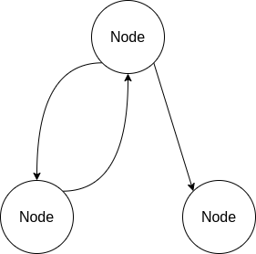
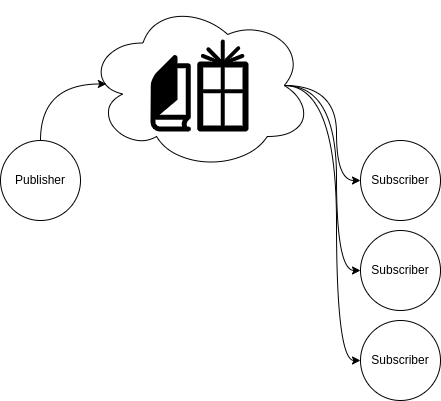
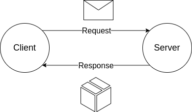
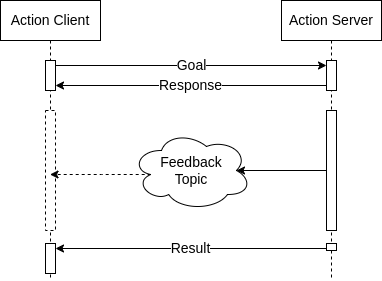
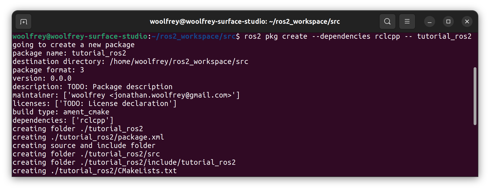

# ROS2 C++ Tutorials

This repository contains a series of coding tutorials based on the 3 communication protocols in ROS2:

- [Publishers & subscribers](https://github.com/Woolfrey/tutorial_ros2/blob/publisher/README.md#publishers--subscribers),
- [Clients & services](https://github.com/Woolfrey/tutorial_ros2/blob/service/README.md#service--client), and
- [Action servers & action clients](https://github.com/Woolfrey/tutorial_ros2/blob/action/README.md#action-servers--action-clients).

### Contents:
 - [What Are They?](#what-are-they-thinking)
 - [Getting Started](#getting-started-checkered_flag)

## What Are They? :thinking:

These classes, clients, and servers are embedded within a `Node` which processes / sends / receives different types of data being sent over the ROS2 network.

<p align="center">
  
  <br>
  <em>Figure 1: Nodes in ROS2 combine different communication protocols to achieve complex tasks.</em>
</p>

Any number of these communicators may combined within a `Node` to achieve a desired task. The type of communication method depends on the type of data being transmitted, and how it is expected to be processed:

**_Table 1: Properties of ROS2 Communication Protocols._**
| Sender | Receiver | Node Interaction | Periodicity | Example(s) |
|--------|----------|------------------|-------------|------------|
| Publisher | Subscriber | One ➡️ Many | Frequent | Sensor data, joystick inputs 🕹️ |
| Client | Service | One ↔️ One| Upon request | Retreiving map updates 🗺️ |
| (Action) Client | (Action) Server | One ↔️ One | Upon request, with frequent updates. | Moving a robot to a target location :dart: |

The `Publisher` and `Subcriber` protocol is analogous to the role of a news agency, or book store. A printing press will publish magazines and/or books that are sent to a store. They are made publically available for people to purchase of their own volition. The type of data being communicated is fast, frequent, and numerous.

<p align="center">
  
  <br>
  <em>Figure 2: Publishers make data publicly available for any number of subscribers.</em>
</p>

The `Client` and `Service` protocol is more akin to a postal service. A request is sent by a `Client` directly to a `Server`, who will process said request and send a reponse. The type of data being communicated is fast, infrequent, and sparse.

<p align="center">
  
  <br>
  <em>Figure 3: Clients and services exchange information privately and directly.</em>
</p>

The `Action Client` and `Action Server` protocol is analogous to requesting transport with Uber. The request is made, a driver confirms the response, and updates are given in real time on how close the driver is to arrival. The interaction is infrequent, like the `Server` & `Client` protocol, but frequent updates are provided like the `Publisher` & `Subscriber`.

<p align="center">
  
  <br>
  <em>Figure 4: Actions carry out goals over an extended period of time, providing feedback.</em>
</p>

[⬆️ Back to top.](https://github.com/Woolfrey/tutorial_ros2/blob/main/README.md#ros2-c-tutorials)

## Getting Started :checkered_flag:

Make a directory for your ROS2 workspace, for example `ros2_workspace`:
```
mkdir ros2_workspace
```
Navigate inside of this new folder, and create a `src` directory:
```
cd ros2_workspace/ && mkdir src
```
Now navigate inside this new folder:
```
cd src/
```
and create the new package:
```
ros2 pkg create --dependencies rclcpp -- tutorial_ros2
```

<p align="center">
  
  <br>
  <em> Figure 5: Creating a new package for the tutorial in ROS2.</em>
</p>

The folder structure should look something like this:
```
ros2_workspace/
└── src/
    ├── include/
    |    └── tutorial_ros/
    ├── src/
    ├── CMakeLists.txt
    └── package.xml
```
The important files for a functional ROS2 package are `CMakeLists.txt` and `package.xml`.

More information can be found in the [official ROS2 tutorial page](https://docs.ros.org/en/foxy/Tutorials/Beginner-Client-Libraries/Creating-Your-First-ROS2-Package.html).


[⬆️ Back to top.](https://github.com/Woolfrey/tutorial_ros2/blob/main/README.md#ros2-c-tutorials)
