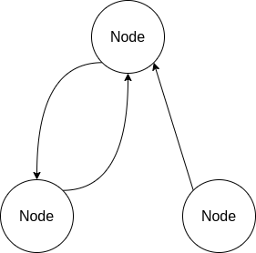
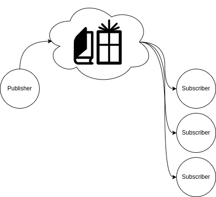
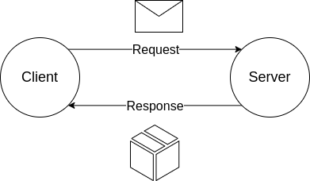

# ROS2 C++ Tutorials

This repository contains a series of coding tutorials based on the 3 communication protocols in ROS2:

1. Publishers & subscribers,
2. Clients & services, and
3. Action servers & action clients.

These objects are embedded within a `Node` which processes / sends / receives different types of data being sent over the ROS2 network.

  
   
  <em>Figure 1: Nodes in ROS2 combine different communication protocols to achieve complex tasks.</em>

Any number of these communicators may combined within a `Node` to achieve a desired task. The type of communication method depends on the type of data being transmitted, and how it is expected to be processed:

**_Table 1: Properties of ROS2 Communication Protocols._**
| Sender | Receiver | Node Interaction | Periodicity | Example(s) |
|--------|----------|------------------|-------------|------------|
| Publisher | Subscriber | One ➡️ Many | Frequent | Sensor data, joystick inputs 🕹️ |
| Client | Service | One ↔️ One| Upon request | Retreiving map updates 🗺️ |
| (Action) Client | (Action) Server | One ↔️ One | Upon request, with frequent updates. | Moving a robot to a target location :dart: |

The `Publisher` and `Subcriber` protocol is analogous to the role of a news agency, or book store. A printing press will publish magazines and/or books that are sent to a store. They are made publically available for people to purchase of their own volition. The type of data being communicated is fast, frequent, and numerous.

  
   
  <em>Figure 2: Publishers make data publicly available for any number of subscribers.</em>

The `Client` and `Service` protocol is more akin to a postal service. A request is sent by a `Client` directly to a `Server`, who will process said request and send a reponse. The type of data being communicated is fast, infrequent, and sparse.

  
   
  <em>Figure 2: Clients and services exchange information privately and directly.</em>

The `Action Client` and `Action Server` protocol is analogous to requesting transport with Uber. The request is made, a driver confirms the response, and updates are given in real time on how close the driver is to arrival. The interaction is infrequent, like the `Server` & `Client` protocol, but frequent updates are provided like the `Publisher` & `Subscriber`.
