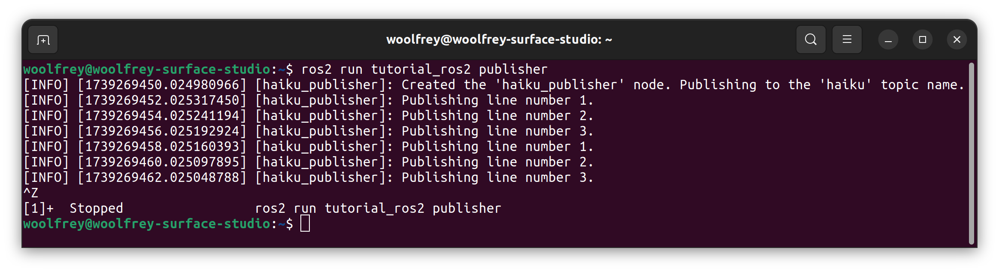
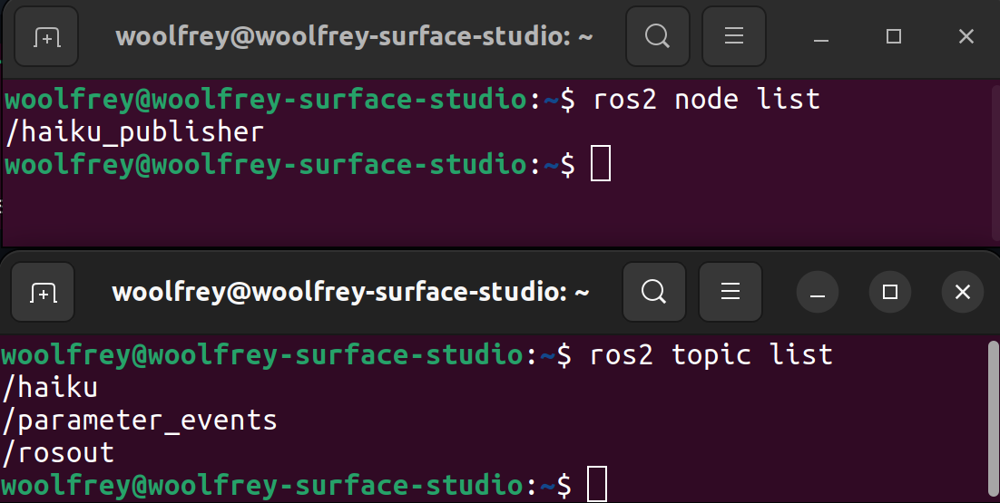
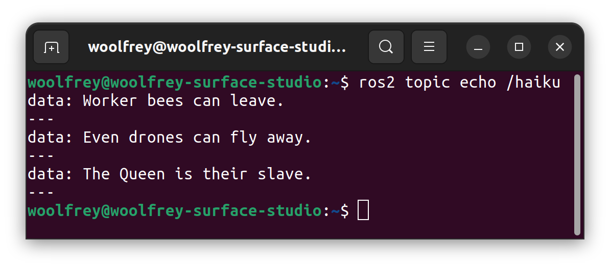
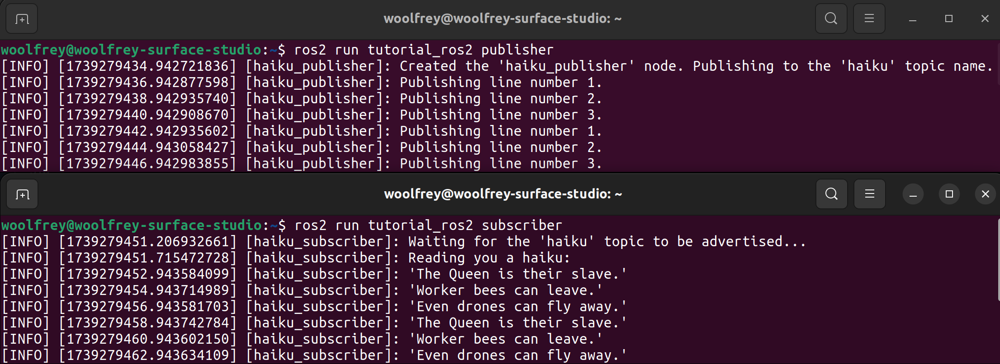

# 1. Publishers & Subscribers

[🔙 Back to `main`](https://github.com/Woolfrey/tutorial_ros2/blob/main/README.md#ros2-c-tutorials)

This coding tutorial demonstrates how to implement a simple ROS2 pubisher and C++, and a subscriber.

### Contents:
- [1.1 Creating a Publisher](#11-creating-a-publisher)
  - [1.1.1 Create the Header File](#111-create-the-header-file-page_facing_up)
  - [1.1.2 Create the Source File](#112-create-the-source-file-page_facing_up)
  - [1.1.3 Create the Executable](#113-create-the-executable-gear)
  - [1.1.4 Create Configuration Files](#114-edit-the-configuration-files-hammer_and_wrench)
  - [1.1.5 Compiling & Running the Package](#115-compiling--running-the-package-computer)
- [1.2 Creating a Subscriber](#12-creating-a-subscriber)
  - [1.2.1 Create the Header File](#121-create-the-header-file-page_facing_up)
  - [1.2.2 Create the Source File](#122-create-the-source-file-page_facing_up)
  - [1.2.3 Create the Executable](#123-create-the-executable-gear)
  - [1.2.4 Create Configuration Files](#124-edit-the-configuration-files-hammer_and_wrench)
  - [1.2.5 Compiling & Running the Package](#125-compiling--running-the-package-computer)
 
The folder structure for our package will look like this:
```
ros2_workspace/
├─ build/
├─ install/
├─ log/
└── src/
    └── tutorial_ros2/
        ├─ include/
        |   ├─  HaikuPublisher.h
        |   └── HaikuSubscriber.h
        ├─ src/
        |   ├─  HaikuPublisher.cpp
        |   ├─  HaikuSubscriber.cpp
        |   ├─  publisher.cpp
        |   └── subscriber.cpp
        ├── CMakeLists.txt
        └── package.xml
```

## 1.1 Creating a Publisher

### 1.1.1 Create the Header File :page_facing_up:

It is good practice in C++ to separate the declarations for functions and classes from the source code. This makes it more efficient for the computer to compile large projects.

ROS2 is also designed around the use of object-oriented programming (OOP). This is useful because we can:
1. Spawn multiple objects of the same type (e.g. multiple cameras in a single robot system), and
2. Launch multiple nodes within a single executable.

Inside of `include/HaikuPublisher.h` insert the following code:

```
#ifndef HAIKU_PUBLISHER_H
#define HAIKU_PUBLISHER_H

#include <rclcpp/rclcpp.hpp>
#include <std_msgs/msg/string.hpp>

class HaikuPublisher : public rclcpp::Node
{
    public:

        HaikuPublisher(const std::string &nodeName = "haiku_publisher",
                       const std::string &topicName = "haiku",
                       const int &milliseconds = 2000);
    private:
    
        unsigned int _lineNumber = 1;

        rclcpp::TimerBase::SharedPtr _timer;
        
        rclcpp::Publisher<std_msgs::msg::String>::SharedPtr _publisher;
                
        void timer_callback();
};

#endif
```

#### Inspecting the Code :mag:

The significant lines of code to consider are:
- `#include <rclcpp/rclcpp.hpp>`: The ROS2 C++ client library which provides all the necessary functionality.
- `class HaikuPublisher : public rclcpp::Node`: Or HaikuPublisher class inherits the ROS2 Node class, and all its functions (methods) and variables (members).
- `rclcpp::TimerBase::SharedPtr _timer`: This is used to regulate how often we publish messages.
- `rclcpp::Publisher<std_msgs::msg::String>::SharedPtr _publisher`: This object is directly responsible for publishing our message over the ROS2 network.
- `void timer_callback();` This will be combined with the `_timer` and perform the core work for this class.

[⬆️ Return to top.](https://github.com/Woolfrey/tutorial_ros2/blob/publisher/README.md#1-publishers--subscribers)

### 1.1.2 Create the Source File :page_facing_up:

Inside the `src/HaikuPublisher.cpp` insert:
```
#include <HaikuPublisher.h>
#include <functional>
#include <chrono>

HaikuPublisher::HaikuPublisher(const std::string &nodeName,
                               const std::string &topicName,
                               const int &milliseconds)
                               : Node(nodeName)
{
    _publisher = this->create_publisher<std_msgs::msg::String>(topicName, 1);

    _timer = this->create_wall_timer(
        std::chrono::milliseconds(milliseconds),
        std::bind(&HaikuPublisher::timer_callback, this)
    );
    
    RCLCPP_INFO(this->get_logger(),
                "Created the '%s' node. Publishing to the '%s' topic name.",
                nodeName.c_str(), topicName.c_str());
}

void HaikuPublisher::timer_callback()
{
    std_msgs::msg::String message;

    if     (_lineNumber == 1) message.data = "Worker bees can leave.";
    else if(_lineNumber == 2) message.data = "Even drones can fly away.";
    else if(_lineNumber == 3) message.data = "The Queen is their slave.";
    
    RCLCPP_INFO(this->get_logger(), "Publishing line number %d.", _lineNumber);

    if(_lineNumber < 3) _lineNumber++;
    else                _lineNumber = 1;

    _publisher->publish(message);
}
```

#### Inspecting the Code :mag:

##### _The Publisher:_

Inside the `HaikuPublisher()` constructor, we create the publisher obect:
```
_publisher = this->create_publisher<std_msgs::msg::String>(topicName, 1);
```
The core components in its creation are:
- `this->` refers to the `rclcpp::Node`, and is attaching the publisher object to it.
- The `<std_msgs::msg::String>` is a template argument, using a ROS string message type.
- The `topicName` argument is what will appear to other nodes on the ROS2 network.
- The `1` argument refers to the queue length for number of messages available at a time.

Any subscribers to this topic will:
1. Find and connect to the topic via a matching `topicName`, and
2. Require the same type of message template, in this case the `std_msgs::msg::String`.

##### _The Callback Method:_

The `_timer` creates a function that runs independently at its own frequency:
```
_timer = this->create_wall_timer(std::chrono::milliseconds(milliseconds), std::bind(&HaikuPublisher::timer_callback, this));
```
The important components in its creation are:
- `this->` referring to the `rclcpp::Node` inside the `HaikuPublisher` class,
- The `milliseconds` argument is the time it will take between repeating the code (inverse of frequency)
- The `std::bind` tells the timer to call the `timer_callback` method in the `HaikuPublisher` class, and
- The `this` argument is referring to this class; the `HaikuPublisher`.

Inside the `HaikuPublisher::timer_callback()` method we:
1. Create a message of the type `std_msgs::msg::String`, which matches the template argument when we created the publisher,
2. Assign content to the field `message.data = ...`, then
3. Make this available on the ROS2 network using `_publisher->publish(message)`.

### 1.1.3 Create the Executable :gear:

Now we create a C++ executable that ROS2 will actually run.

We create a new file in `src/publisher.cpp` and insert the code:
```
#include "HaikuPublisher.h"
#include "rclcpp/rclcpp.hpp"

int main(int argc, char *argv[])
{
    rclcpp::init(argc, argv);
    
    auto haikuPublisher = std::make_shared<HaikuPublisher>("haiku_publisher", "haiku", 2000);

    rclcpp::executors::SingleThreadedExecutor executor;
    executor.add_node(haikuPublisher);
    executor.spin();
    
    rclcpp::shutdown();
    
    return 0;
}
```

#### Inspecting the Code :mag:

The line `rclcpp::init(argc,arv)` starts ROS2.

We instantiate a `HaikuPublisher` object using the line:
```
auto haikuPublisher = std::make_shared<HaikuPublisher>("haiku_publisher", "haiku", 2000);
```

Then, we create an executor which will run our node:
```
rclcpp::executors::SingleThreadedExecutor executor;
```
we attach our node using the `executor.add_node(haikuPublisher)` line, and `executor.spin()` makes it run indefinitely.

Note that we _could_ have put the `HaikuPublisher` class definition, source code, _and_ executable `main()` all inside the `publisher.cpp` file. But the advantage of this structure is that we can make _multiple_ publishers and run them simultaneously:
```
auto haiku1 = std::make_shared<HaikuPublisher>("haiku_publisher_1", "haiku", 1000);
auto haiku2 = std::make_shared<HaikuPublisher>("haiku_publisher_2", "haiku", 2000);
auto haiku3 = std::make_shared<HaikuPublisher>("haiku_publisher_3", "haiku", 3000);

rclcpp::executors::MultiThreadedExecutor executor;
executor.add_node(haiku1);
executor.add_node(haiku2);
executor.add_node(haiku3);
executor.spin();
```
Each publisher can run using its own unique parameters. It also means we can attached _different_ classes to the executor (other publishers, services, action servers, etc.).

[⬆️ Return to top.](https://github.com/Woolfrey/tutorial_ros2/blob/publisher/README.md#1-publishers--subscribers)

### 1.1.4 Edit the Configuration Files :hammer_and_wrench:

#### _The CMake File:_

Inside the `tutorial_ros2/CMakeLists.txt` file we need to add:
```
find_package(std_msgs REQUIRED)
```
since we are using the `std_msgs::msg::String` field inside our publisher and subscriber.

We then add these line(s) to actually compile the executable:
```
add_executable(publisher src/publisher.cpp
                         src/HaikuPublisher.cpp)
```
where:
1. We assign the name `publisher` which is what will be known to ROS2 when we want to run the node,
2. Link the `publisher.cpp` _and_ the `HaikuPublisher.cpp` source files.

Then we need to list the dependencies:
```
ament_target_dependencies(publisher
                          "rclcpp"
                          "std_msgs")
```
This says that the `publisher` executable relies on the ROS2 C++ client libraries `rclcpp` (obviously!), and needs the `std_msgs` package within ROS2.

We must also add these lines to install the publisher executable so that ROS2 can find it and run it:
```
install(TARGETS
        publisher
        DESTINATION lib/${PROJECT_NAME}/
)
```

#### _The package.xml File:_

Inside the `tutorial_ros2/package.xml` file ensure the following lines are present:
```
<depend>rclcpp</depend>
<depend>std_msgs</depend>
```

[⬆️ Return to top.](https://github.com/Woolfrey/tutorial_ros2/blob/publisher/README.md#1-publishers--subscribers)

### 1.1.5 Compiling & Running the Package :computer:

Navigate back to the root of your ROS2 workspace, e.g. `cd ~/ros2_workspace`, then run:
```
colcon build --packages-select tutorial_ros2
```
Make sure to source the changes, if you haven't already added it to your `bash.rc` file:
```
source ./install/setup.bash
```
Now run:
```
ros2 run tutorial_ros2 publisher
```
<p align="center">
  
  <br>
  <em> Figure 1: Running the Haiku publisher node.</em>
</p>

#### Checking the Output :eyes:

We can check that our node has launched correctly using:
```
ros2 node list
```
We can also see what topic(s) it is publishing with:
```
ros2 topic list
```

<p align="center">
  
  <br>
  <em>Figure 2: Listing the ROS2 nodes and topics.</em>
</p>
  
Notice that the names matche the ones we assigned when we created the publisher object inside the `publisher.cpp` file:
```
auto haikuPublisher = std::make_shared<HaikuPublisher>("haiku_publisher", "haiku", 2000);
```
We can check the output of the `/haiku` topic using `ros2 topic echo /haiku`:

<p align="center">
  
  <br>
  <em>Figure 3: Echoing the `/haiku` topic will print the output to the console.</em>
</p>

[⬆️ Return to top.](https://github.com/Woolfrey/tutorial_ros2/blob/publisher/README.md#1-publishers--subscribers)

## 1.2 Creating a Subscriber

A subscriber retrieves data from a known ROS2 topic (provided by a publisher) and processes it to create new, useful outputs. For example, robot arms will publish a `sensor_msgs::msg::JointState` topic containing information on the joint positions and velocities. A robot controller can subscribe to this data to compute the robot kinematics and perform motion planning.

### 1.2.1 Create the Header File :page_facing_up:

As before, we are going to separate our interface definitions from Create a file `include/HaikuSubscriber.h` and insert the following code:
```
#ifndef HAIKU_SUBSCRIBER_H
#define HAIKU_SUBSCRIBER_H

#include <rclcpp/rclcpp.hpp>
#include <std_msgs/msg/string.hpp>

class HaikuSubscriber : public rclcpp::Node
{
    public:
        
        HaikuSubscriber(const std::string &nodeName = "haiku_subscriber",
                        const std::string &topicName = "haiku");
        
    private:
    
        rclcpp::Subscription<std_msgs::msg::String>::SharedPtr _subscriber;

        void callback(const std_msgs::msg::String::SharedPtr msg);
};

#endif
```

#### Inspecting the Code :mag:

As before, we define a public constructor `HaikuSubscriber(...)` with input arguments for the node name, and topic.

The two important properties are:
1. `rclcpp::Subscription<std_msgs::msg::String>::SharedPtr _subscriber;`: This object will specifically handle the acquisition of messages for a defined topic, and
2. `void callback(const std_msgs::msg::String::SharedPtr msg);`: A method that will be executed every time a new message is published, and process it in some way.

Note that the subscription has a template argument `<std_msgs::msg::String>`; it expects a ROS2 string data type to be published, so this must match the output from the publisher.

The callback method then takes a `const std_msgs::msg::String::SharedPtr` as an argument. The `const` means that we cannot alter the data in any way; only read it, copy it, etc.

[⬆️ Return to top.](https://github.com/Woolfrey/tutorial_ros2/blob/publisher/README.md#1-publishers--subscribers)

### 1.2.2 Create the Source File :page_facing_up:

In `src/HaikuSubscriber.cpp` we specify the implementation for the constructor, and callback method:
```
#include <HaikuSubscriber.h>

HaikuSubscriber::HaikuSubscriber(const std::string &nodeName,
                                 const std::string &topicName)
                                 : Node(nodeName)
{
    RCLCPP_INFO(this->get_logger(), "Waiting for the '%s' topic to be advertised...", topicName.c_str());
    
    int elapsedTime = 0;
    
    while (rclcpp::ok() && this->count_publishers(topicName) == 0)
    {
        if (elapsedTime >= 5000)
        {
            RCLCPP_ERROR(this->get_logger(),
                         "The '%s' topic did not appear within 5 seconds of waiting. "
                         "Shutting down.", topicName.c_str());
                         
            rclcpp::shutdown();
            
            return;
        }
        
        rclcpp::sleep_for(std::chrono::milliseconds(500));
        elapsedTime += 500;
    }

    _subscriber = this->create_subscription<std_msgs::msg::String>(topicName,1, std::bind(&HaikuSubscriber::callback, this, std::placeholders::_1));

    RCLCPP_INFO(this->get_logger(), "Reading you a haiku:");
}

void
HaikuSubscriber::callback(const std_msgs::msg::String::SharedPtr msg)
{
    RCLCPP_INFO(this->get_logger(), "'%s'", msg->data.c_str());
}
```

#### Inspecting the Code :mag:

##### _The Constructor:_

The `while` loop is used to ensure that the topic is being published before proceeding:
```
    while (rclcpp::ok() && this->count_publishers(topicName) == 0)
    {
      ...
    }
```
This feature can be used to ensure that critical data is available before proceeding, and is also a helpful warning to users.

In this line we create the subscription:
```
_subscriber = this->create_subscription<std_msgs::msg::String>(topicName,1, std::bind(&HaikuSubscriber::callback, this, std::placeholders::_1));
```
The key components are:
- `this->` referring to this particular ROS node to which it is attached,
- The `<std_msgs::msg::String>` template argument which must match that of the publisher,
- `topicName` which will look for a topic under that specific name,
- `std::bind` which ties the `HaikuSubscriber::callback` method found in `this` class to the subscriber.

> [!NOTE]
> By using the aforementioned `while` loop to check for the `topicName` topic, we ensure that its subscriber is generated.

##### _The Callback Method:_

The `callback()` method in this case is trivial. It simply prints the received message to the console.

There are many other possibilies for what to do with the data. For example, we may do computations on numerical data and then use another publisher to make its output available. Or we may store it within a class member to be utilised at a later time.

[⬆️ Return to top.](https://github.com/Woolfrey/tutorial_ros2/blob/publisher/README.md#1-publishers--subscribers)

### 1.2.3 Create the Executable :gear:

As before, we create a separate executable in `src/subscriber.cpp`:
```
#include "HaikuSubscriber.h"
#include "rclcpp/rclcpp.hpp"

int main(int argc, char *argv[])
{
    rclcpp::init(argc, argv);
    
    auto haikuSubscriber = std::make_shared<HaikuSubscriber>("haiku_subscriber", "haiku");

    rclcpp::executors::SingleThreadedExecutor executor;
    executor.add_node(haikuSubscriber);
    executor.spin();
    
    rclcpp::shutdown();
    
    return 0;
}
```

#### Inspecting the Code :mag:

The line:
```
rclcpp::init(argc, argv)
```
starts up ROS2 independent of any other node, including the subscriber.

Here we create an instance of the `HaikuSubscriber` class:
```
auto haikuSubscriber = std::make_shared<HaikuSubscriber>("haiku_subscriber", "haiku");
```
The argument "haiku" must match what is advertised by the publisher.

Then, in these 3 lines of code:
```
rclcpp::executors::SingleThreadedExecutor executor;
executor.add_node(haikuSubscriber);
executor.spin();
```
we:
1. Create at executor for specifically running the node,
2. Attach the newly created subscriber to the executor with `add_node(...)`, and then
3. Run the executor / node with `spin()`.

Using the OOP & executor framework, we could have run the publisher and subscriber in the same executable:
```
auto haikuPublisher = std::make_shared<HaikuPublisher>("haiku_publisher", "haiku", 1000);
auto haikuSubscriber = std::make_shared<HaikuSubscriber>("haiku_subscriber", "haiku");

rclcpp::executors::SingleThreadedExecutor executor;
executor.add_node(haikuPublisher);
executor.add_node(haikuSubscriber);
executor.spin();
```
By running them in separate executables, however, we can make the code more modular and independent.

[⬆️ Return to top.](https://github.com/Woolfrey/tutorial_ros2/blob/publisher/README.md#1-publishers--subscribers)

### 1.2.4 Edit the Configuration Files :hammer_and_wrench:

We need to update the `CMakeListstxt` file to compile & install the new `subscriber.cpp` executable.

First we can specify the name as `subscriber` and link the relevant source files:
```
add_executable(subscriber src/subscriber.cpp
                          src/HaikuSubscriber.cpp)
```
Then list the dependencies, the same as the publisher:
```
ament_target_dependencies(subscriber
                          "rclcpp"
                          "std_msgs")
```

Then add the previously named `subscriber` to the install list so ROS2 can find it and run it:
```
install(TARGETS
        publisher
        subscriber
        DESTINATION lib/${PROJECT_NAME}/
)
```

[⬆️ Return to top.](https://github.com/Woolfrey/tutorial_ros2/blob/publisher/README.md#1-publishers--subscribers)

### 1.2.5 Compiling & Running the Package :computer:

Navigate back to the root directory:
```
~/ros2_workspace
```
Then build the package:
```
colcon build --packages-select tutorial_ros2
```

It is a good idea to ensure that the publisher is first running:
```
ros2 run tutorial_ros2 publisher
```
Then in a separate terminal you can run the subscriber:
```
ros2 run tutorial_ros2 subscriber
```
<p align="center">
  
  <br>
  <em> Figure 4: The subscriber reading the output from the publisher.</em>
</p>


[⬆️ Return to top.](https://github.com/Woolfrey/tutorial_ros2/blob/publisher/README.md#1-publishers--subscribers)

[🔙 Back to `main`](https://github.com/Woolfrey/tutorial_ros2/blob/main/README.md#ros2-c-tutorials)
